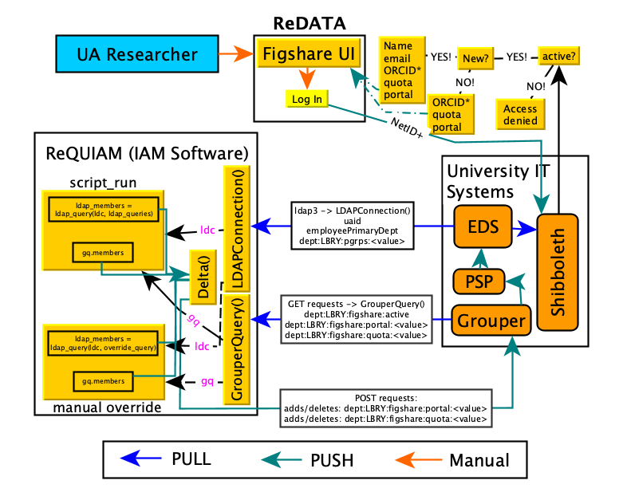

# 

[](https://github.com/UAL-RE/ReQUIAM/actions?query=workflow%3A%22Python+package%22)


- [Overview](#overview)
- [Getting Started](#getting-started)
    - [Requirements](#requirements)
    - [Installation Instructions](#installation-instructions)
    - [Configuration Settings](#configuration-settings)
    - [Testing Installation](#testing-installation)
- [Execution](#execution)
    - [Manual Changes](#manual-changes)
    - [API Management of Grouper Groups](#api-management-of-grouper-groups)
- [Versioning](#versioning)
- [Continuous Integration](#continuous-integration)
- [Changelog](#changelog)
- [Authors](#authors)
- [License](#license)

--------------

## Overview

This identity and access management (IAM) software performs the following for
the [University of Arizona's Research Data Repository (ReDATA)](https://arizona.figshare.com):
 1. It conducts EDS queries to retrieve classification information
    (e.g., student, staff, and/or faculty) and association with
    organization codes (i.e., departments/colleges)
 2. Based on classification information and primary organization
    association, it sets `ismemberof` [Grouper](https://www.incommon.org/software/grouper/) membership

The Grouper memberships are as follow:
 1. The allowed user quota for upload (in bytes), determined by the user's
    classification, is set by Grouper `figshare:quota:<value>` group
 2. The "research theme/portal", determined by the user's organizational
    affiliation, is set by Grouper `figshare:portal:<value>` group

For the latter, these portals and their association with University
organization code(s) are defined within this
[CSV file](https://raw.githubusercontent.com/UAL-RE/ReQUIAM_csv/master/requiam_csv/data/research_themes.csv).

Note that access is granted to the service through membership in a Grouper
`figshare:active` group.  These memberships are done indirectly based on
other Grouper membership set forth by University Library privileges.

This software is based on the [existing patron software](https://github.com/ualibraries/patron-groups)
developed for the [University of Arizona Libraries](https://new.library.arizona.edu/).

An illustration of the service architecture workflow is provided below.

# 

## Getting Started

These instructions will have the code running on your local or virtual machine.


### Requirements

You will need the following to have a working copy of this software. See
[installation](#installation-instructions) steps:
1. Python (>=3.7.9)
2. [`pandas`](https://pandas.pydata.org/) ([0.25.3](https://pandas.pydata.org/pandas-docs/version/0.25.3/))
3. [`ldap3`](https://ldap3.readthedocs.io/en/latest/) (2.6.1)
4. [`requests`](https://requests.readthedocs.io/en/master/) (2.22.0)
5. [`numpy`](https://numpy.org/doc/) ([1.18.0](https://numpy.org/doc/1.18/))

### Installation Instructions

#### Python and setting up a `conda` environment

First, install a working version of Python (>=3.7.9).  We recommend using the
[Anaconda](https://www.anaconda.com/distribution/) package installer.

After you have Anaconda installed, you will want to create a separate `conda` environment
and activate it:

```
$ (sudo) conda create -n figshare_patrons python=3.7
$ conda activate figshare_patrons
```

Next, clone this repository into a parent folder:

```
(figshare_patrons) $ cd /path/to/parent/folder
(figshare_patrons) $ git clone https://github.com/UAL-RE/ReQUIAM.git
```

With the activated `conda` environment, you can install with the `setup.py` script:

```
(figshare_patrons) $ cd /path/to/parent/folder/ReQUIAM
(figshare_patrons) $ (sudo) python setup.py develop
```

This will automatically installed the required `pandas`, `ldap3`, `requests`, and `numpy` packages.

You can confirm installation via `conda list`

```
(figshare_patrons) $ conda list requiam
```

You should see that the version is `0.18.0`.

### Configuration Settings

Configuration settings are specified through the [config/figshare.ini](config/figshare.ini) file.
The most important settings to set are those populated with `***override***`.
However, for our scripts, these settings can be specified using multi-character 
flag options, such as `--ldap_password`.
Note that most `figshare.ini` settings can be overwritten through the command line.

For manual override (v0.11.0) where IAM portal and quota settings differ from
norm, `config` will include two CSV templates for portal and quota to specify
those changes.


### Testing Installation

To test the installation without performing any `portal` or `quota` query,
execute the following command:

```
(figshare_patrons) $ export password="insert_password"
(figshare_patrons) $ export persist_path="/path/to/persistent/storage"
(figshare_patrons) $ ./scripts/script_run --config config/figshare.ini \
                       --persistent_path $persist_path \
                       --ldap_password $password --grouper_password $password
```

Test command-line flags (`test` and `test_reverse`) are available to test EDS
query and Grouper synchronization (with the `sync` flag) by executing the following :

```
(figshare_patrons) $ ./scripts/script_run --test \
                       --config config/figshare.ini --persistent_path $persist_path \
                       --ldap_password $password --grouper_password $password --sync
```

Note that the above will add a test NetID account to the following Grouper
group: `arizona.edu:dept:LBRY:figshare:test`

Without the `sync` flag, the above command line will perform a
"dry run". It will indicate what Grouper updates will occur.

To undo this change, use the `test_reverse` flag:

```
(figshare_patrons) $ ./scripts/script_run --test_reverse \
                       --config config/figshare.ini --persistent_path $persist_path \
                       --ldap_password $password --grouper_password $password --sync
```

## Execution

To execute the script and update Grouper and EDS, include the `portal`, `quota`,
and `sync` command-line flags:

```
(figshare_patrons) $ ./scripts/script_run --config config/figshare.ini \
                       --persistent_path $persist_path \
                       --ldap_password $password --grouper_password $password \
                       --quota --portal --sync
```

Note: Without the `sync` flag, the above command line will perform a
"dry run" where both `quota` and `portal` queries are conducted. It will
indicate what Grouper updates will occur.

By default, changes occur on the `figshare` stem. Execution can occur on the
`figtest` stem with the `--grouper_figtest` boolean flag.

There are additional options to run a subset of portals or organization codes.
This is specified with the `--org_codes` or `--groups` options, which accepts
comma-separated inputs. For this to work, the `--portal` must be set. If
`--quota` is specified, those users are added to the appropriate group.
Note that with this option, it will create and populate a `figtest:group_active`
group that allows for indirect membership association. There are a couple of
interactive prompts to create the `figtest:group_active` group or provide an
existing one to use/update.


### Manual Changes

While the primary use of this software is automated updates through Grouper,
there are additional scripts for handling.  One of those pertains to overriding
default changes (e.g., a user's quota, involvement with a specific portal).
To this end, the `user_update` script should be used. It has several features:
 1. It can add a number of users to a specific group and also remove them from
    its previous group assignment(s)
 2. It will update the appropriate CSV files. This ensures that the changes
    stay when the automated script `script_run` is executed.
 3. It has the ability to move a user to the "main" or "root" portal
 4. It has a number of built-in error handling to identify possible input error.
    This includes:
       - A username that is not valid
       - A Grouper group that does not exist
       - Prevent any action if the user belongs to the specified group

Execution can be done as follows:

```
(figshare_patrons) $ ./scripts/user_update --config config/figshare.ini \
                       --persistent_path $persist_path \
                       --ldap_password $password --grouper_password $password \
                       --quota 123456 --portal testportal --netid <username> --sync
```
Here, the script will update the specified `<username>` to be associated with
the `123456` quota and the `testportal` portal.  Much like `script_run`,
execution requires the `--sync` flag. Otherwise, a list of changes will be
provided. Note: `<username>` can be a list of comma-separated users
(e.g., `user1,user2,user3`) or a .txt file with each username on a new line.
```
user1
user2
user3
```

To remove a user from its current assignment and place it on the main portal,
use: `--portal root`. For quota, the `root` option will remove any quota
association (this is equivalent to a zero quota)

The manual CSV files are specified in the config file:
```
# Manual override files
portal_file = config/portal_manual.csv
quota_file = config/quota_manual.csv
```

These settings, much like other settings (see `python requiam/user_update --help`),
can be overwritten on the command line:
  ```
  --portal_file /path/to/portal_manual.csv
  --quota_file /path/to/quota_manual.csv
  ```
Note that working templates are provided in the config folder for
[quota](config/quota_manual_template.csv) and [portal](config/portal_manual_template.csv).

To disable updating the the manual CSV files, you can include the following flags:

`--portal_file_noupdate --quota_file_noupdate`

By default, changes occur on the `figshare` stem. Execution can occur on the
`figtest` stem with the `--grouper_figtest` boolean flag.


### API Management of Grouper Groups

The `add_grouper_groups` currently create and assign privileges to groups
through the Grouper API.  It uses the above existing Google Sheet for research
themes and sub-portals. In addition, another
[Google Sheet](https://docs.google.com/spreadsheets/d/12Rhfpz4aWIcOGOOu0Ev4sZNMiXvLr3FSl_83yRd3h4k/edit?usp=sharing)
exists for the quotas. The script will check whether a group exists.  If the
`add` flag is provided, it will create the group and assign privileges for
GrouperSuperAdmins and GrouperAdmins. If a group already exists, it will
skip to the privilege assignments.  To execute the script:

```
(figshare_patrons) $ ./scripts/add_grouper_groups --config config/figshare.ini \
                       --persistent_path $persist_path --grouper_password $password \
                       --main_themes --sub_portals --quota --add
```

The `main_themes`, `sub_portals` and `quota` flags will conduct checks and
create those sets of groups.  Without the `add` flag, it is a dry run.  By
default this works on a testing Grouper stem `figtest`.  Set the `production`
flag to implement on the production stem, `figshare`.

## Versioning

We use [SemVer](http://semver.org/) for versioning. For the versions available,
see the [tags on this repository](https://github.com/UAL-RE/ReQUIAM/tags).

## Continuous Integration

Initially we started using [Travis CI](https://travis-ci.com); however, due
to the change in
[pricing for open-source repositories](https://travis-ci.community/t/org-com-migration-unexpectedly-comes-with-a-plan-change-for-oss-what-exactly-is-the-new-deal/10567),
we decided to use
[GitHub Actions](https://docs.github.com/en/free-pro-team@latest/actions).
Currently, there are two GitHub Action workflows:
1. A "Create release" workflow, [`create-release.yml`](.github/workflows/create-release.yml)
   for new releases when a tag is pushed
2. A "Python package" workflow, [`python-package.yml`](.github/workflows/python-package.yml)
   for builds and tests

## Changelog

A list of released features and their issue number(s).
List is sorted from moderate to minor revisions for reach release.

See the [CHANGELOG](CHANGELOG.md) for all changes since project inception.

v0.14.0:
 * Travis CI integration #91
 * Add summary data for `script_run` #99
 * Enable setting 'root' for portal in `ManualOverride` #88
 * Bug: equality checks #93

v0.13.0 - v0.13.6:
 * Make scripts executable #82, #95
 * Enhancements to `script_run` script:
   - Option to run with subset of org codes or portal names #65
   - Option to switch between production and testing Grouper stems for #68
   - Disable adding undergrads to 100MB quota #69
   - Bug: Remove extraneous messages from `ManualOverride` #77
 * Enhancements to `user_update` script:
   - Option to create indirect membership for active #72
   - Option to not update manual CSV files #76
 * Bug: handling of multi-classification members for `quota` #78
 * Minor: Additional messaging for verbosity in `script_run` #39 #80
 * GitHub Action to create releases with tagged version #83, #89
 * Bug: Issue with `ManualOverride` #85

v0.12.0 - 0.12.2:
 * Grouper API tool, `GrouperAPI` #42, #60
 * Grouper group creation with `add_grouper_group` script #42, #58
 * Include `multi-user` feature for `user_update` script #52
 * Re-vamp of logging in all scripts and classes #57
 * Minor: buffering of `pandas` DataFrame for `script_run` #64
 * Minor: Code refactoring in `grouper_query`, `ManualOverride` #62, #63
 * Minor: Perform checks to ensure that Grouper groups exist before API calls #66
 * Minor: Option to switch between production and testing Grouper stems for `user_update` #73

v0.11.0 - 0.11.3:
 * Include manual override tool, `ManualOverride` #31, #47
 * Manual user update with user_update script #31
 * Ability to add and remove users from the `figshare:active` group #43
 * Minor: Packaging/re-organization of scripts into `scripts/` #44
 * Minor: Updates to scripts #44, #49, #50
 * Minor: Add option for persistent storage of logs
 
v0.10.0 - 0.10.2:
 * Illustration of software architecture workflow diagram #29
 * Documentation update for configuration settings
 * Bug fix: incorrect URL for `ReQUIAM_csv` #40

v0.9.0 - 0.9.1:
 * Script to determine membership in an organization ("org code") #32
 * Minor: package rename for PEP8

v0.8.0 - 0.8.3:
 * Software renaming #23
 * Minor fixes

v0.7.0:
 * Testing option for `script_run` #18

v0.6.0 - 0.6.1:
 * Primary script for automated patron management #16

v0.5.0 - 0.5.1:
 * Grouper and EDS comparison tool, `Delta` #10, #15

v0.4.0:
 * LDAP quota-based query #4
 * Primary `GrouperQuery` tool #7

v0.3.0:
 * Multi-organization query and LDAP results merge #2

v0.2.0:
 * UA-specific EDS queries

v0.1.0:
 * Initial LDAP query tool and testing


## Authors

* Chun Ly, Ph.D. ([@astrochun](http://www.github.com/astrochun)) - [University of Arizona Libraries](https://github.com/ualibraries), [Research Engagement](https://github.com/UAL-RE)

* Damian Romero ([@damian-romero](https://www.github.com/damian-romero)) - [University of Arizona Libraries](https://github.com/ualibraries), [Research Engagement](https://github.com/UAL-RE)

See also the list of
[contributors](https://github.com/UAL-RE/ReQUIAM/contributors) who participated in this project.


## License

This project is licensed under the [MIT License](https://opensource.org/licenses/MIT) - see the [LICENSE](LICENSE) file for details.
